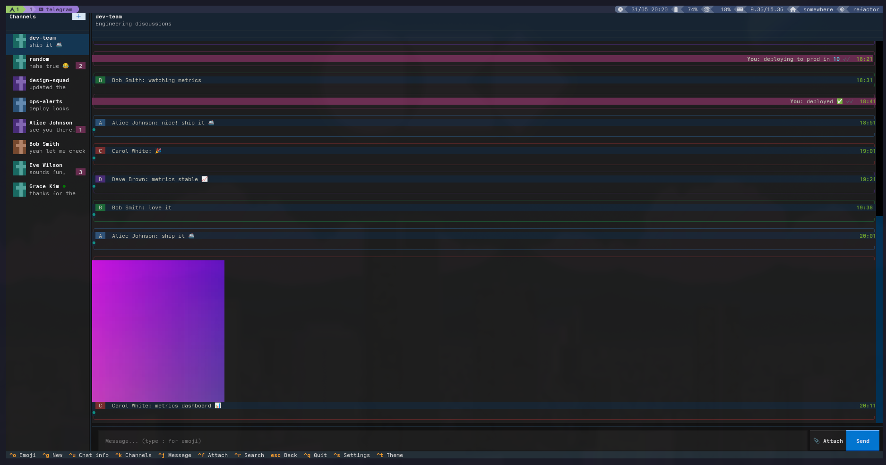
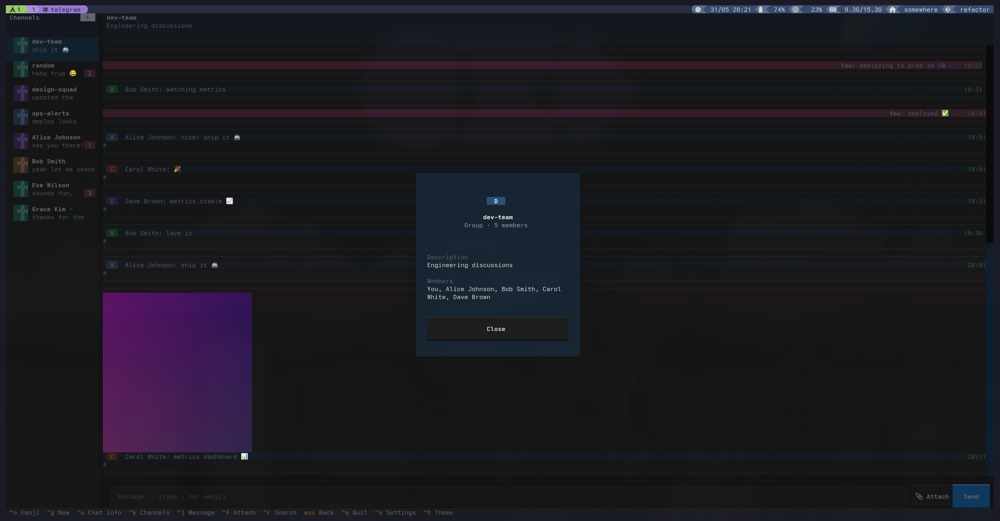
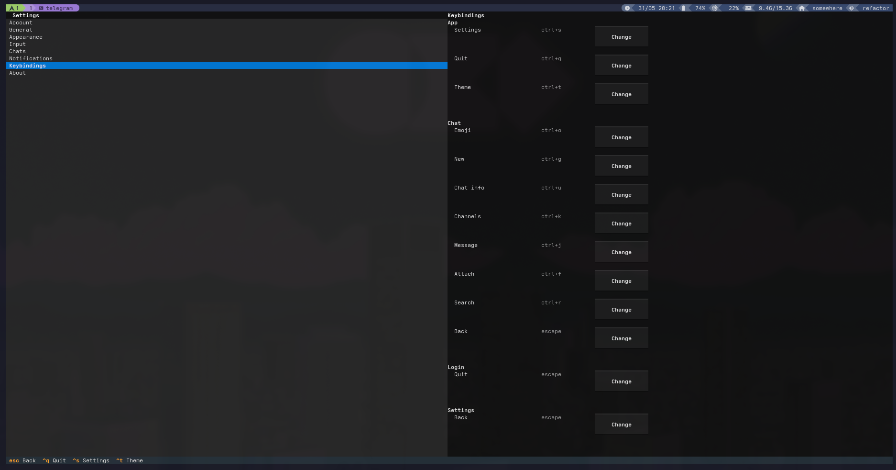
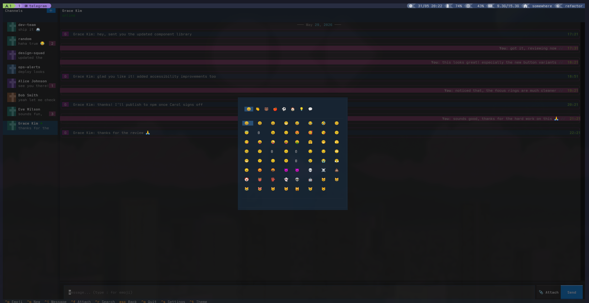

# tgm — Terminal Telegram Client

> **Work in progress.** Core functionality works in mock mode, but real Telegram integration is still being built out. Expect rough edges, missing features, and occasional breakage.

A full-featured Telegram client that runs entirely in the terminal, built with [Textual](https://textual.textualize.io/) and [Telethon](https://github.com/LonamiWebs/Telethon).


## Screenshots

<table>
  <tr>
    <td align="center">
      <br/>
      <sub>Chat — inline image rendering</sub>
    </td>
    <td align="center">
      <br/>
      <sub>Channel / user info</sub>
    </td>
  </tr>
  <tr>
    <td align="center">
      <br/>
      <sub>Settings — keybindings</sub>
    </td>
    <td align="center">
      <br/>
      <sub>Emoji picker</sub>
    </td>
  </tr>
</table>

## What it is

tgm brings a messenger-style interface to the terminal. Channels and DMs on the left, messages on the right — same layout as desktop Telegram, no GUI required. Useful if you spend most of your time in a terminal and don't want to switch context, or if you're on a machine without a graphical environment.

## Features

- **Chats & DMs** — all dialogs in a sidebar with unread badges and online indicators
- **Sending & editing** — send messages, edit or delete them, reply to specific messages
- **Images** — incoming photos are rendered inline using half-block unicode characters (▀)
- **Emoji** — autocomplete triggered by a configurable character (`:`, `@`, `#`, `;`) plus a full emoji picker
- **Search** — in-chat message search and global channel search
- **Pinned messages** — displays the pinned message banner, supports pin/unpin
- **File attachments** — attach and send files via a file picker
- **Keybindings** — fully remappable from the settings screen
- **Themes** — switchable accent colors, message density, text opacity
- **Per-channel settings** — mute, custom color, notification toggle

## Install

```bash
pip install telethon textual pillow
# or with poetry:
poetry install
```

## Usage

```bash
# Real Telegram account (needs api_id + api_hash from my.telegram.org)
tgm

# Mock mode — runs with fake data, no account needed
tgm-mock
```

On first launch, set your API credentials in **Settings → Account**.

## Keybindings

| Key | Action |
|-----|--------|
| `Tab` / `Shift+Tab` | Cycle focus between panels |
| `↑ ↓` / `j k` | Navigate messages |
| `r` | Reply to selected message |
| `e` | Edit selected message |
| `d` | Delete selected message |
| `p` | Pin / unpin selected message |
| `Ctrl+F` | Search in current chat |
| `Ctrl+P` | Global search |
| `Ctrl+,` | Open settings |
| `Esc` | Cancel / go back |

All bindings are remappable via **Settings → Keybindings**.

## Architecture

```
tgm/
├── core/           # Models, store, client protocol, AppContext sub-protocols
├── controllers/    # Auth, messaging, channels, media, settings (mixin-based)
├── screens/        # Chat, login, search, settings screens
├── widgets/        # Messages, channels, input bar, emoji
├── media/          # Avatar + image rendering (PIL → half-block unicode)
├── config/         # Settings, keybindings, themes
└── dev/            # Mock client for development without a real account
```

Controllers are mixins composed into `TgmApp`. Screens and widgets are dumb — they only render data and emit events; all state changes go through controllers. The client layer is abstracted behind `ClientProtocol`, split into `AuthProtocol`, `MessageOperations`, `MediaOperations`, and `ChannelOperations` so individual roles can be tested in isolation.

## Development

```bash
# Run with mock data (no Telegram account needed)
tgm-mock

# Run tests
pytest
```

## Status

The project is under active development. Here's roughly where things stand:

| Area | Status |
|------|--------|
| Mock mode (dev/demo) | Working |
| UI layout & navigation | Working |
| Sending & editing messages | Working |
| Image rendering | Working |
| Settings screen | Working |
| Real Telethon client | In progress |
| Notifications | Stubbed, not wired |
| Video / stickers / documents | Not implemented |
| Message reactions | Not implemented |
| Voice messages | Not planned |

If something looks broken, it probably is. Run `tgm-mock` first to check whether the issue is in the UI layer or the Telegram integration.

## Requirements

- Python 3.14+
- Telegram API credentials ([my.telegram.org](https://my.telegram.org))
- A terminal with Unicode and 256-color support
